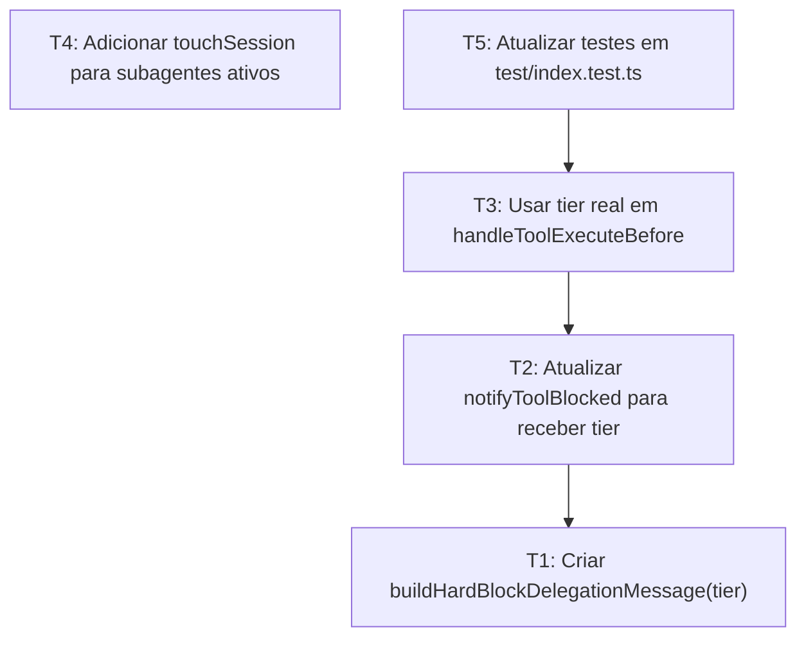

# Tasks: hardblock-tier-message

## Estratégia

Corrigir a origem do texto de delegação para que o tier seja dinâmico, propagar o `tier` até o toast e a mensagem de bloqueio, atualizar os testes que referenciam a constante removida e, de forma independente, tocar sessões de subagentes durante a execução de ferramentas.

## Dependências

## Tasks

### T1: Criar `buildHardBlockDelegationMessage(tier)`

**Estimativa:** 10m
**Verificação:** `npm run typecheck`
**Dependências:** Nenhuma

#### Sub-tasks

1. Arquivo `src/prompts.ts`: adicionar função `buildHardBlockDelegationMessage(tier: string): string` seguindo o padrão dos builders existentes, incluindo JSDoc e retorno `"Delegue para @{tier}. Esta ferramenta esta bloqueada para execucao direta."`
2. Arquivo `src/constants.ts`: remover a constante `HARD_BLOCK_DELEGATION_MESSAGE`
3. Arquivo `src/plugin-orchestrator.ts`: manter o comportamento atual enquanto a constante não for migrada nesta tarefa

### T2: Atualizar `notifyToolBlocked` para receber `tier`

**Estimativa:** 5m
**Verificação:** `npm run typecheck`
**Dependências:** T1

#### Sub-tasks

1. Arquivo `src/plugin-orchestrator.ts`: mudar a assinatura de `notifyToolBlocked(): Promise<void>` para `notifyToolBlocked(tier: string): Promise<void>`
2. Arquivo `src/plugin-orchestrator.ts`: importar `buildHardBlockDelegationMessage` de `./prompts.js`
3. Arquivo `src/plugin-orchestrator.ts`: usar `message: buildHardBlockDelegationMessage(tier),` no toast
4. Arquivo `src/plugin-orchestrator.ts`: atualizar o JSDoc do método para documentar o parâmetro `tier`

### T3: Usar o tier real em `handleToolExecuteBefore`

**Estimativa:** 5m
**Verificação:** `npm run typecheck`
**Dependências:** T1, T2

#### Sub-tasks

1. Arquivo `src/plugin-orchestrator.ts`: passar `tier` na chamada de bloqueio, substituindo `await this.notifyToolBlocked()` por `await this.notifyToolBlocked(tier)`
2. Arquivo `src/plugin-orchestrator.ts`: substituir `output.message = HARD_BLOCK_DELEGATION_MESSAGE` por `output.message = buildHardBlockDelegationMessage(tier)`
3. Arquivo `src/plugin-orchestrator.ts`: remover o import de `HARD_BLOCK_DELEGATION_MESSAGE`, se não for mais usado

### T4: Adicionar `touchSession` para subagentes ativos

**Estimativa:** 5m
**Verificação:** `npm run typecheck`
**Dependências:** Nenhuma

#### Sub-tasks

1. Arquivo `src/plugin-orchestrator.ts`: dentro do branch `if (this.subagentSessions.has(input.sessionID))`, adicionar `this.touchSession(input.sessionID)` como primeira instrução do bloco
2. Arquivo `src/plugin-orchestrator.ts`: manter a normalização de args e o restante do fluxo de subagentes inalterados

### T5: Atualizar testes em `test/index.test.ts`

**Estimativa:** 10m
**Verificação:** `npx vitest run`
**Dependências:** T1, T2, T3

#### Sub-tasks

1. Arquivo `test/index.test.ts`: trocar o import de `HARD_BLOCK_DELEGATION_MESSAGE` por `buildHardBlockDelegationMessage`
2. Arquivo `test/index.test.ts`: atualizar as asserções que usam `HARD_BLOCK_DELEGATION_MESSAGE` para `buildHardBlockDelegationMessage('heavy')`
3. Arquivo `test/index.test.ts`: atualizar a asserção do toast para esperar `buildHardBlockDelegationMessage(tier)`
4. Arquivo `test/index.test.ts`: validar que os testes continuam cobrindo comportamento de bloqueio e compatibilidade com tier `heavy`
