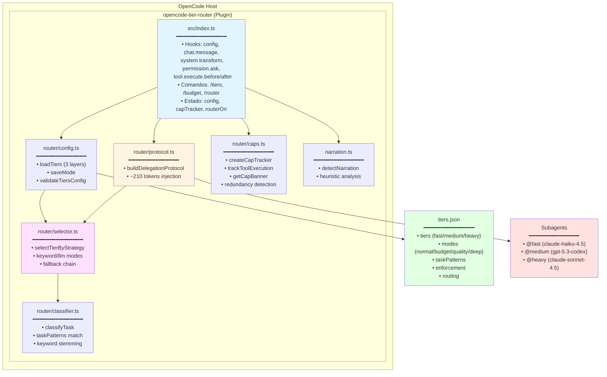
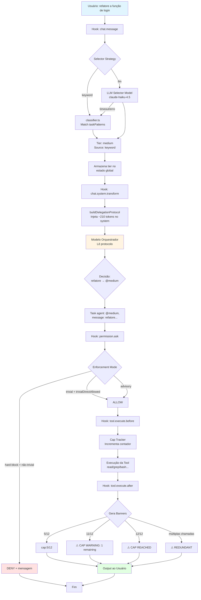

# opencode-tier-router — Arquitetura

## Visão Arquitetural

O **opencode-tier-router** é implementado como um **plugin OpenCode** que intercepta hooks do ciclo de vida de chat e execução de ferramentas para realizar **roteamento inteligente baseado em tiers de modelos**.

A arquitetura segue os princípios de:

- **Baixo acoplamento**: plugin não depende de infraestrutura externa
- **Zero latência adicional**: roteamento via prompt injection, não chamada de modelo separado
- **Fail-safe**: todos os hooks envolvidos em `try/catch` com comportamento best-effort
- **Configuração declarativa**: um único arquivo `tiers.json` controla todo o comportamento

## Decisões Arquiteturais (ADRs)

As decisões arquiteturais estão documentadas em `.specs/STATE.md`. Resumo das decisões ativas:

### AD-001: Plugin, não standalone agent ou proxy

**Decisão**: Implementar roteamento como plugin OpenCode, não como agente dedicado ou proxy externo.

**Razão**:
- Plugins têm acesso direto aos hooks `chat.system.transform` e `tool.execute.*`
- Overhead de ~210 tokens (protocol injection)
- Zero infraestrutura externa
- Zero latência adicional de rede

**Trade-off**:
- Plugin roda no processo do OpenCode — bugs podem afetar o host
- Mitigação: todos os hooks em `try/catch` com best-effort

**Referência**: src/index.ts (todos os hooks wrapped)

---

### AD-002: Single `tiers.json`, sem state persistence, sem provider presets

**Decisão**: Usar um único arquivo `tiers.json` para configuração; sem state persistence; sem presets de provider.

**Razão**:
- OpenCode já é multi-provider — model strings carregam provider info (ex: `anthropic/claude-sonnet-4-5`)
- Presets são redundantes
- State persistence adiciona complexidade sem valor
- Mudanças de modo reescrevem `tiers.json` diretamente

**Trade-off**:
- Mudanças de modo exigem write no filesystem
- Simplifica raciocínio: um arquivo é a verdade absoluta

**Referência**: src/router/config.ts

---

### AD-003: Roteamento via prompt injection, não router model separado

**Decisão**: O orquestrador (modelo principal) lê o protocolo de delegação (~210 tokens) injetado no system prompt e delega via `Task()`.

**Razão**:
- Paper "Agent-as-a-Router" demonstra que **informação > raciocínio** para roteamento
- Nenhum modelo extra, nenhum fine-tuning, nenhuma chamada adicional
- Referência de implementação (opencode-model-router) prova eficácia: até 83% redução de custo

**Trade-off**:
- Sem política de roteamento aprendida (nenhum modelo de routing treinado)
- Bom o suficiente para casos reais

**Referência**: src/router/protocol.ts:4-45

---

### AD-004: Enforcement padrão é hard-block com `trivialDirectAllowed=true`

**Decisão**: Enforcement padrão é `hard-block`, mas tarefas triviais fast podem executar diretamente. Advisory permanece disponível via config.

**Razão**:
- Sessões reais mostraram drift em modo advisory-only (modelo/agente errado apesar das hints)
- Hard-block aumenta determinismo e controle de custo
- Trivial direct allowed evita fricção em tarefas simples (ex: "find X")

**Trade-off**:
- Padrão mais restritivo pode interromper execução direta de tools até que delegação ocorra
- Mitigação: trivial tasks continuam permitidas + usuário pode voltar para advisory

**Referência**: src/index.ts:131-137 (função `isTrivialFastTask`)

---

### AD-005: Config resolution em camadas (project > global > defaults)

**Decisão**: Resolução de config usa estratégia em camadas:
1. `./tiers.json` (projeto local) — prioridade máxima
2. `~/.config/opencode/tiers.json` (global)
3. Defaults internos (FALLBACK_CONFIG)

**Razão**:
- Usuários rodam OpenCode em diferentes repos com diferentes providers/budget
- Global default evita boilerplate (não precisa criar tiers.json em todo projeto)
- Local override permite customização por projeto
- Mesmo padrão do `opencode.json` (project overrides global)

**Trade-off**:
- Resolução de path ligeiramente mais complexa
- Quando nenhum existe, CREATE sempre no project dir (visibilidade + editabilidade)

**Referência**: src/router/config.ts:147-217 (função `loadTiers`)

---

## Componentes e Responsabilidades

### Diagrama de Arquitetura



### 1. `src/index.ts` — Plugin Entry Point

**Responsabilidades**:
- Registrar hooks do plugin (`config`, `chat.message`, `chat.system.transform`, `permission.ask`, `tool.execute.before`, `tool.execute.after`)
- Implementar comandos do plugin (`/tiers`, `/budget`, `/router`)
- Manter estado global do plugin (config, cap tracker, router on/off)
- Mapear agentes nativos OpenCode para tiers (`explore → @fast`, `build → @medium`, etc.)

**Hooks registrados**:

| Hook | Função |
|------|--------|
| `config` | Carrega tiers.json e inicializa plugin |
| `chat.message` | Classifica tarefa e determina tier |
| `chat.system.transform` | Injeta protocolo de delegação no system prompt |
| `permission.ask` | Controla enforcement (hard-block vs advisory) |
| `tool.execute.before` | Rastreia caps antes de execução |
| `tool.execute.after` | Rastreia caps após execução e injeta banners |

**Referência**: src/index.ts:156-456

---

### 2. `src/router/config.ts` — Configuração

**Responsabilidades**:
- Carregar `tiers.json` em camadas (project → global → defaults)
- Validar estrutura e tipos
- Salvar mudanças de modo em `tiers.json`
- Definir tipos TypeScript para config

**Principais funções**:

| Função | Assinatura | O que faz |
|--------|-----------|-----------|
| `loadTiers` | `(projectDir, globalDir) => Promise<RouterConfig>` | Resolve e carrega config em camadas |
| `saveMode` | `(projectDir, globalDir, mode) => Promise<void>` | Persiste mudança de modo |
| `validateTiersConfig` | `(parsed) => RouterConfig` | Valida estrutura do JSON |

**Referência**: src/router/config.ts:1-343

---

### 3. `src/router/protocol.ts` — Protocol Injection

**Responsabilidades**:
- Construir protocolo de delegação compacto (~210 tokens)
- Incluir tiers, modos, routing strategy, enforcement rules, cost signals
- Informar ao modelo orquestrador como delegar

**Estrutura do protocolo**:

```
## Model Delegation Protocol
Tiers: @fast=github-copilot/claude-haiku-4.5(1x) @medium=... @heavy=...
Default: @medium
Routing: strategy=keyword selector=...
R: @fast→find/grep/search... @medium→implement/refactor... @heavy→design/architecture...
Mode: normal (balanced — use cheapest matching tier, fallback to default)
Rule: Classify user intent by keywords. For non-trivial requests, delegate to the cheapest matching tier.
Rule: Trivial requests may execute directly.
Rule: Enforcement: HARD-BLOCK enabled. Non-trivial requests MUST delegate...
Rule: Respect [cap:N/MAX], [⚠ CAP WARNING], [⚠ CAP REACHED], [⚠ REDUNDANT] banners...
Cost signal: @fast≈1x, @medium≈5x, @heavy≈20x. Minimize cost while preserving task adequacy.
```

**Principais funções**:

| Função | Assinatura | O que faz |
|--------|-----------|-----------|
| `buildDelegationProtocol` | `(cfg: RouterConfig) => string` | Gera protocolo formatado |
| `classifyTask` | `(text, taskPatterns) => TierName \| null` | Wrapper para classificação |

**Referência**: src/router/protocol.ts:4-49

---

### 4. `src/router/classifier.ts` — Classificação de Tarefas

**Responsabilidades**:
- Classificar intenção do usuário por keywords (`taskPatterns`)
- Usar stemming básico para aumentar cobertura (ex: "buscar" ↔ "busc")
- Retornar tier adequado ou `null` se nenhum match

**Lógica**:
1. Normaliza texto (lowercase, trim)
2. Para cada tier (fast, medium, heavy):
   - Verifica se alguma keyword de `taskPatterns[tier]` aparece no texto
3. Retorna primeiro tier com match, ou `null`

**Principais funções**:

| Função | Assinatura | O que faz |
|--------|-----------|-----------|
| `classifyTask` | `(text, taskPatterns) => TierName \| null` | Classifica por keyword match |

**Referência**: src/router/classifier.ts:1-28

---

### 5. `src/router/selector.ts` — Seleção de Tier com Fallback

**Responsabilidades**:
- Selecionar tier usando estratégia configurada (`keyword` ou `llm`)
- Implementar fallback chain: `llm → keyword → defaultTier`
- Quando `strategy=llm`: chamar modelo selector (ex: claude-haiku-4.5) para classificar

**Estratégias**:

| Estratégia | Comportamento | Fallback |
|------------|---------------|----------|
| `keyword` | Usa `classifier.ts` diretamente | Se nenhum match → `defaultTier` |
| `llm` | Chama modelo rápido para classificar | Se timeout/erro → keyword → defaultTier |

**Principais funções**:

| Função | Assinatura | O que faz |
|--------|-----------|-----------|
| `selectTierByStrategy` | `(cfg, text, chatApi?) => Promise<TierSelection>` | Seleciona tier com fallback chain |

**Referência**: src/router/selector.ts:1-220

---

### 6. `src/router/caps.ts` — Cap Tracking e Redundância

**Responsabilidades**:
- Rastrear número de reads realizados por subagentes
- Detectar trabalho redundante (mesmo agente chamado múltiplas vezes)
- Gerar banners de warning (`[cap:N/MAX]`, `[⚠ CAP WARNING]`, `[⚠ CAP REACHED]`, `[⚠ REDUNDANT]`)

**Lógica de caps**:
- Cada tier tem um `cap` configurado (ex: fast=8, medium=12, heavy=20)
- A cada read executado, incrementa contador
- Quando próximo do limite, injeta warning no output
- Quando atinge limite, injeta `CAP REACHED`

**Principais funções**:

| Função | Assinatura | O que faz |
|--------|-----------|-----------|
| `createCapTracker` | `() => CapTracker` | Cria instância do tracker |
| `trackToolExecution` | `(agentId, toolName) => void` | Registra execução de tool |
| `getCapBanner` | `(agentId, maxCap) => string` | Gera banner de cap |

**Referência**: src/router/caps.ts:1-150

---

### 7. `src/narration.ts` — Detecção de Narração

**Responsabilidades**:
- Detectar se output do agente é narração (texto explicativo) vs. trabalho real (código, diffs, dados)
- Heurística: muitas frases declarativas sem blocos de código ou dados estruturados

**Uso**:
- Evitar penalizar agentes que narram muito mas ainda não executaram trabalho real
- Ajustar caps dinamicamente

**Principais funções**:

| Função | Assinatura | O que faz |
|--------|-----------|-----------|
| `detectNarration` | `(text) => boolean` | Retorna `true` se texto é majoritariamente narração |

**Referência**: src/narration.ts:1-40

---

## Fluxo de Roteamento (Detalhado)

### Visão Geral do Fluxo End-to-End



### Detalhamento Passo a Passo

#### 1. Usuário envia mensagem

```
User: "refatore a função de login"
```

#### 2. Hook `chat.message` (src/index.ts:200-250)

1. Extrai texto da mensagem
2. Chama `selectTierByStrategy(cfg, text, chatApi)`
3. Selector retorna: `{ tier: 'medium', source: 'keyword' }`
4. Armazena tier selecionado em estado global

#### 3. Hook `chat.system.transform` (src/index.ts:260-310)

1. Constrói protocolo de delegação via `buildDelegationProtocol(cfg)`
2. Injeta protocolo no system prompt
3. Modelo orquestrador recebe:

```
## Model Delegation Protocol
Tiers: @fast=... @medium=... @heavy=...
Default: @medium
R: @fast→find/grep... @medium→implement/refactor... @heavy→design...
Mode: normal (balanced)
Rule: Classify user intent. For non-trivial requests, delegate to cheapest matching tier.
Rule: Enforcement: HARD-BLOCK enabled. Non-trivial MUST delegate.
Cost signal: @fast≈1x, @medium≈5x, @heavy≈20x.
```

#### 4. Modelo orquestrador decide

Modelo lê protocolo e entende:
- Tarefa é "refatore" → `@medium`
- Deve delegar via `Task()` para agente `@medium`

Executa:

```javascript
Task({ agent: "@medium", message: "refatore a função de login" })
```

#### 5. Hook `permission.ask` (src/index.ts:320-370)

Se enforcement for `hard-block`:
- Verifica se sessão principal está tentando executar tools diretamente em tarefa não-trivial
- Se sim: **bloqueia** com `deny` + mensagem explicativa
- Se tarefa trivial (`isTrivialFastTask`) e `trivialDirectAllowed=true`: permite

#### 6. Hooks `tool.execute.before/after` (src/index.ts:380-450)

- Rastreia reads (`glob`, `grep`, `read`, etc.)
- Incrementa contador de cap
- Injeta banners:
  - `[cap:5/12]` — ainda longe do limite
  - `[⚠ CAP WARNING: 1 remaining]` — próximo do limite
  - `[⚠ CAP REACHED (12/12)]` — atingiu limite
  - `[⚠ REDUNDANT]` — mesmo agente chamado múltiplas vezes

---

## Configuração (`tiers.json`)

### Estrutura Completa

```json
{
  "mode": "normal",
  "tiers": {
    "fast": {
      "model": "github-copilot/claude-haiku-4.5",
      "costRatio": 1,
      "cap": 8
    },
    "medium": {
      "model": "github-copilot/gpt-5.3-codex",
      "costRatio": 5,
      "cap": 12
    },
    "heavy": {
      "model": "github-copilot/claude-sonnet-4.5",
      "costRatio": 20,
      "cap": 20
    }
  },
  "modes": {
    "normal": {
      "description": "Balanced routing",
      "defaultTier": "medium"
    },
    "budget": {
      "description": "Cost-first",
      "defaultTier": "fast"
    },
    "quality": {
      "description": "Quality-first",
      "defaultTier": "medium"
    },
    "deep": {
      "description": "Depth-first",
      "defaultTier": "heavy"
    }
  },
  "taskPatterns": {
    "fast": ["find", "grep", "search", "buscar", "procurar"],
    "medium": ["implement", "refactor", "fix", "criar", "corrigir"],
    "heavy": ["design", "architecture", "debug", "analisar", "revisar"]
  },
  "enforcement": {
    "mode": "hard-block",
    "trivialDirectAllowed": true
  },
  "routing": {
    "strategy": "keyword",
    "selectorModel": "github-copilot/claude-haiku-4.5",
    "selectorTimeoutMs": 1200,
    "selectorMaxTokens": 16
  }
}
```

### Campos Principais

#### `mode` (string)

Modo ativo. Define `defaultTier` e comportamento de roteamento.

Valores válidos: qualquer chave em `modes` (ex: `"normal"`, `"budget"`, `"quality"`, `"deep"`)

#### `tiers` (object)

Define modelos e limites por tier.

| Campo | Tipo | Descrição |
|-------|------|-----------|
| `model` | string | ID do modelo (formato `provider/model`) |
| `costRatio` | number | Sinal de custo relativo (1x = fast, 5x = medium, 20x = heavy) |
| `cap` | number | Limite de reads antes de warnings/caps |

#### `modes` (object)

Define perfis de roteamento.

| Campo | Tipo | Descrição |
|-------|------|-----------|
| `description` | string | Descrição legível |
| `defaultTier` | string | Tier padrão quando nenhum match de keyword |

#### `taskPatterns` (object)

Keywords para classificação de tarefas.

Estrutura:

```json
{
  "fast": ["keyword1", "keyword2", ...],
  "medium": [...],
  "heavy": [...]
}
```

#### `enforcement` (object)

Controla comportamento de enforcement.

| Campo | Tipo | Valores | Descrição |
|-------|------|---------|-----------|
| `mode` | string | `"advisory"` ou `"hard-block"` | Advisory só orienta; hard-block bloqueia execução direta |
| `trivialDirectAllowed` | boolean | `true` ou `false` | Se `true`, tarefas triviais fast podem executar direto mesmo em hard-block |

#### `routing` (object)

Controla estratégia de seleção de tier.

| Campo | Tipo | Descrição |
|-------|------|-----------|
| `strategy` | string | `"keyword"` (padrão) ou `"llm"` |
| `selectorModel` | string | Modelo usado para seleção quando `strategy="llm"` |
| `selectorTimeoutMs` | number | Timeout da chamada LLM selector |
| `selectorMaxTokens` | number | Limite de tokens na resposta do selector |

---

## Tratamento de Falhas

### 1. Config não encontrado

**Cenário**: `tiers.json` não existe no projeto nem no global.

**Comportamento**:
- Plugin carrega `FALLBACK_CONFIG` interno
- Log de warning (se disponível)
- Continua operação normalmente

**Referência**: src/index.ts:147-155

---

### 2. Config inválido

**Cenário**: `tiers.json` existe mas JSON é inválido ou faltam campos obrigatórios.

**Comportamento**:
- Lança `ConfigError`
- Plugin tenta fallback para defaults
- Se crítico: plugin pode desativar-se

**Referência**: src/router/config.ts:250-280

---

### 3. Modelo não encontrado

**Cenário**: `tiers.<tier>.model` aponta para modelo inexistente no provider.

**Comportamento**:
- OpenCode retorna erro "Model not found"
- Plugin não trata diretamente (responsabilidade do usuário ajustar config)
- Solução: verificar com `/models` e ajustar `tiers.json`

---

### 4. Timeout na seleção LLM

**Cenário**: `routing.strategy="llm"` e chamada ao selector model demora mais que `selectorTimeoutMs`.

**Comportamento**:
- Selector retorna `null`
- Fallback chain: `llm (timeout) → keyword → defaultTier`
- `TierSelection.source` indica `"fallback-keyword"` ou `"fallback-default"`

**Referência**: src/router/selector.ts:140-180

---

### 5. Hook crash

**Cenário**: Erro não tratado dentro de um hook do plugin.

**Comportamento**:
- Todos os hooks envolvidos em `try/catch` com best-effort
- Erro logado (se disponível)
- Hook retorna valor seguro (ex: config original, permissão concedida)
- Sessão OpenCode **não** crasha

**Referência**: src/index.ts (cada hook tem `try/catch`)

---

## Extensibilidade

### 1. Adicionar novo tier

**Passos**:
1. Editar `tiers.json`:

```json
{
  "tiers": {
    "ultra-fast": {
      "model": "github-copilot/some-tiny-model",
      "costRatio": 0.5,
      "cap": 5
    }
  }
}
```

2. Adicionar keywords em `taskPatterns.ultra-fast`
3. Ajustar `modes.<mode>.defaultTier` se necessário

**Limitação**: Código assume tiers `fast`, `medium`, `heavy` em alguns lugares (ex: tipos). Para novos nomes, ajustar `TierName` type em src/router/selector.ts:4.

---

### 2. Adicionar novo modo

**Passos**:
1. Editar `tiers.json`:

```json
{
  "modes": {
    "experimental": {
      "description": "Uses LLM selector exclusively",
      "defaultTier": "medium"
    }
  }
}
```

2. Trocar modo via `/budget experimental`

---

### 3. Adicionar nova estratégia de routing

**Passos**:
1. Editar src/router/selector.ts
2. Adicionar novo case em `selectTierByStrategy`
3. Atualizar type `RoutingConfig.strategy` em src/router/config.ts:27

Exemplo: adicionar `"hybrid"` que combina keyword + LLM com votação.

---

### 4. Customizar protocolo de delegação

**Passos**:
1. Editar src/router/protocol.ts:4-45
2. Ajustar template do protocolo injetado
3. Rebuild: `npm run build`

**Cuidado**: Protocolo maior aumenta token overhead (alvo: ~210 tokens).

---

## Links Relacionados

- [Documentação do Projeto](./projeto.md) — visão geral, stack, estrutura, comandos
- [AGENTS.md](../AGENTS.md) — workflow de desenvolvimento TLC
- [STATE.md](../.specs/STATE.md) — decisões ativas (AD-001 a AD-005)
- [README.md](../README.md) — overview rápido e instalação

---

## Overhead de Tokens

| Componente | Tokens Aproximados |
|------------|--------------------|
| Protocol injection (system prompt) | ~210 tokens |
| Cap banners por mensagem | ~5-15 tokens |
| Selector LLM call (se `strategy=llm`) | ~50 tokens prompt + 16 tokens response |

**Total estimado por mensagem**: 220-240 tokens (com keyword strategy), 270-300 tokens (com LLM strategy).

---

## Referências

- Paper "Agent-as-a-Router" — fundamentação teórica
- OpenCode Plugin API — `@opencode-ai/plugin`
- Implementação de referência — opencode-model-router

