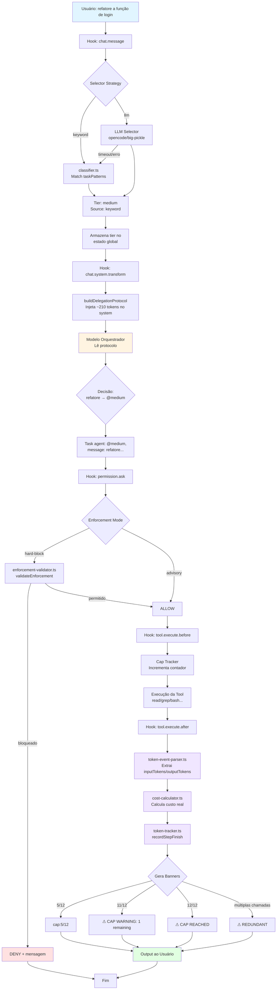

# opencode-tier-router — Arquitetura

## Visão Arquitetural

O **opencode-tier-router** é implementado como um **plugin OpenCode** que intercepta hooks do ciclo de vida de chat e execução de ferramentas para realizar **roteamento inteligente baseado em tiers de modelos**.

A arquitetura segue os princípios de:

- **Baixo acoplamento**: plugin não depende de infraestrutura externa
- **Zero latência adicional**: roteamento via prompt injection, não chamada de modelo separado
- **Fail-safe**: todos os hooks envolvidos em `try/catch` com comportamento best-effort
- **Configuração declarativa**: um único arquivo `tiers.json` controla todo o comportamento

## Decisões Arquiteturais (ADRs)

As decisões arquiteturais estão documentadas em `.specs/STATE.md`. Resumo das decisões ativas:

### AD-001: Plugin, não standalone agent ou proxy

**Decisão**: Implementar roteamento como plugin OpenCode, não como agente dedicado ou proxy externo.

**Razão**:
- Plugins têm acesso direto aos hooks `chat.system.transform` e `tool.execute.*`
- Overhead de ~210 tokens (protocol injection)
- Zero infraestrutura externa
- Zero latência adicional de rede

**Trade-off**:
- Plugin roda no processo do OpenCode — bugs podem afetar o host
- Mitigação: todos os hooks em `try/catch` com best-effort

**Referência**: src/index.ts (todos os hooks wrapped)

---

### AD-002: Single `tiers.json`, sem state persistence, sem provider presets

**Decisão**: Usar um único arquivo `tiers.json` para configuração; sem state persistence; sem presets de provider.

**Razão**:
- OpenCode já é multi-provider — model strings carregam provider info
- Presets são redundantes
- State persistence adiciona complexidade sem valor
- Mudanças de modo reescrevem `tiers.json` diretamente

**Trade-off**:
- Mudanças de modo exigem write no filesystem
- Simplifica raciocínio: um arquivo é a verdade absoluta

**Referência**: src/router/config.ts

---

### AD-003: Roteamento via prompt injection, não router model separado

**Decisão**: O orquestrador (modelo principal) lê o protocolo de delegação (~210 tokens) injetado no system prompt e delega via `Task()`.

**Razão**:
- Paper "Agent-as-a-Router" demonstra que **informação > raciocínio** para roteamento
- Nenhum modelo extra, nenhum fine-tuning, nenhuma chamada adicional

**Trade-off**:
- Sem política de roteamento aprendida
- Bom o suficiente para casos reais

**Referência**: src/router/protocol.ts:10-51

---

### AD-004: Enforcement padrão é hard-block com `trivialDirectAllowed=false`

**Decisão**: Enforcement padrão é `hard-block` com `trivialDirectAllowed=false`. Advisory permanece disponível via config.

**Razão**:
- Sessões reais mostraram drift em modo advisory-only
- Hard-block por padrão aumenta determinismo e controle de custo
- `trivialDirectAllowed=false` força 100% de delegação (AD-007)

**Trade-off**:
- Tarefas triviais também precisam delegar — pode causar estranheza inicial
- Usuário pode configurar `trivialDirectAllowed: true` se preferir

**Referência**: src/index.ts (função `isTrivialFastTask`)

---

### AD-005: Config resolution em camadas (project > global > defaults)

**Decisão**: Resolução de config usa estratégia em camadas:
1. `./tiers.json` (projeto local) — prioridade máxima
2. `~/.config/opencode/tiers.json` (global)
3. Defaults internos (FALLBACK_CONFIG)

**Razão**:
- Usuários rodam OpenCode em diferentes repos com diferentes providers/budget
- Global default evita boilerplate
- Local override permite customização por projeto

**Trade-off**:
- Resolução de path ligeiramente mais complexa
- Quando nenhum existe, CREATE sempre no project dir

**Referência**: src/router/config.ts (função `loadTiers`)

---

### AD-006: Real Token Tracking + Critical Fixes

**Decisão**: Captura real de tokens via `tool.execute.after`, não estimativas heurísticas. Pipeline com 5 correções críticas de design.

**Razão**:
- Estimativas heurísticas são imprecisas para análise de custo real
- Arquitetura original tinha 5 falhas críticas: SRP, temporal coupling, hardcoded thresholds, data loss, unbounded disk

**Trade-off**:
- Pipeline mais complexo (OrphanBuffer, SessionCache, disk persistence)
- Dados precisos para tomada de decisão

**Referência**: src/router/token-tracker.ts, src/router/token-event-parser.ts, src/router/orphan-buffer.ts

---

## Componentes e Responsabilidades

### Diagrama de Arquitetura

```mermaid
graph TD
    subgraph OpenCode["OpenCode Host"]
        subgraph Plugin["opencode-tier-router (Plugin)"]
            Index["src/index.ts<br/>━━━━━━━━━━━━━━━<br/>• Hooks: config, chat.message,<br/>  system.transform, permission.ask,<br/>  tool.execute.before/after<br/>• Comandos: /tiers, /budget, /router,<br/>  /token-report, /token-history,<br/>  /token-compare<br/>• Estado: config, capTracker, routerOn"]

            Orchestrator["src/plugin-orchestrator.ts<br/>━━━━━━━━━━━━━━━<br/>• Hook orchestration<br/>• Chat message handling<br/>• Subagent session tracking"]

            Config["router/config.ts<br/>━━━━━━━━━━━━━━━<br/>• loadTiers (3 layers)<br/>• saveMode<br/>• validateTiersConfig"]

            Protocol["router/protocol.ts<br/>━━━━━━━━━━━━━━━<br/>• buildDelegationProtocol<br/>• ~210 tokens injection"]

            Selector["router/selector.ts<br/>━━━━━━━━━━━━━━━<br/>• selectTierByStrategy<br/>• keyword/llm modes<br/>• fallback chain"]

            Classifier["router/classifier.ts<br/>━━━━━━━━━━━━━━━<br/>• classifyTask<br/>• taskPatterns match<br/>• keyword stemming"]

            Caps["router/caps.ts<br/>━━━━━━━━━━━━━━━<br/>• createCapTracker<br/>• trackToolExecution<br/>• getCapBanner<br/>• redundancy detection"]

            Narration["narration.ts<br/>━━━━━━━━━━━━━━━<br/>• detectNarration<br/>• heuristic analysis"]

            CostCalc["router/cost-calculator.ts<br/>━━━━━━━━━━━━━━━<br/>• calculateCost<br/>• formatCost<br/>• tier ratio calc"]

            EnfValidator["router/enforcement-validator.ts<br/>━━━━━━━━━━━━━━━<br/>• validateEnforcement<br/>• assertEnforcement<br/>• reportEnforcement"]

            subgraph TokenTracking["Token Tracking"]
                TokenTracker["router/token-tracker.ts<br/>━━━━━━━━━━━━━━━<br/>• recordStepFinish<br/>• getSummary<br/>• persistTokenMetrics"]

                TokenParser["router/token-event-parser.ts<br/>━━━━━━━━━━━━━━━<br/>• parseTokenUsage<br/>• TokenEventParser<br/>• DefaultTokenEventParser"]

                OrphanBuf["router/orphan-buffer.ts<br/>━━━━━━━━━━━━━━━<br/>• Event correlation<br/>• 5s retry<br/>• FIFO matching"]

                TokenCmds["router/token-commands.ts<br/>━━━━━━━━━━━━━━━<br/>• /token-report<br/>• /token-history<br/>• /token-compare"]
            end

            subgraph Metrics["Metrics"]
                Aggregator["router/metrics-aggregator.ts<br/>━━━━━━━━━━━━━━━<br/>• session aggregation<br/>• tier accuracy"]

                StorageInt["router/metrics-storage.ts<br/>━━━━━━━━━━━━━━━<br/>• Storage interface"]

                FsStorage["router/filesystem-storage.ts<br/>━━━━━━━━━━━━━━━<br/>• JSON persistence<br/>• LRU + TTL + FIFO"]

                MemStorage["router/in-memory-storage.ts<br/>━━━━━━━━━━━━━━━<br/>• SessionCache<br/>• 100 LRU / 30min TTL"]

                Formatter["router/metrics-formatter.ts<br/>━━━━━━━━━━━━━━━<br/>• Markdown reports<br/>• Session reports"]
            end

            Utils["utils/safe-json.ts<br/>━━━━━━━━━━━━━━━<br/>• Safe JSON parse<br/>• Size limits"]

            Constants["constants.ts<br/>━━━━━━━━━━━━━━━<br/>• FALLBACK_CONFIG<br/>• Named constants"]
        end
    end

    TiersJSON["tiers.json<br/>━━━━━━━━━━━━━━━<br/>• tiers (fast/medium/heavy)<br/>• modes (normal/budget/quality/deep)<br/>• taskPatterns<br/>• enforcement<br/>• routing<br/>• tokenTracking"]

    Subagents["Subagents<br/>━━━━━━━━━━━━━━━<br/>• @fast (opencode/big-pickle)<br/>• @medium (llama.cpp/Nex-N2-mini)<br/>• @heavy (llama.cpp/Nex-N2-mini)"]

    Disk["Disk persistence<br/>━━━━━━━━━━━━━━━<br/>• token-*.json<br/>• LRU eviction<br/>• max 50 files / 30 days"]

    Config --> TiersJSON
    Protocol --> Subagents
    FsStorage --> Disk

    style Index fill:#e1f5ff
    style Protocol fill:#fff4e1
    style Selector fill:#ffe1ff
    style TiersJSON fill:#e1ffe1
    style Subagents fill:#ffe1e1
    style TokenTracking fill:#f0e6ff
    style Metrics fill:#e6f7ff
```



### 1. `src/index.ts` — Plugin Entry Point

**Responsabilidades**:
- Registrar hooks do plugin: `config`, `chat.message`, `chat.system.transform`, `permission.ask`, `tool.execute.before`, `tool.execute.after`, `command.execute.before`
- Implementar comandos do plugin: `/tiers`, `/budget`, `/router`, `/token-report`, `/token-history`, `/token-compare`
- Manter estado global do plugin (config, cap tracker, router on/off)
- Mapear agentes nativos OpenCode para tiers (`explore → @fast`, `build → @medium`, etc.)

**Hooks registrados**:

| Hook | Função |
|------|--------|
| `config` | Carrega tiers.json e inicializa plugin |
| `chat.message` | Classifica tarefa e determina tier |
| `chat.system.transform` | Injeta protocolo de delegação no system prompt |
| `permission.ask` | Controla enforcement (hard-block vs advisory) |
| `tool.execute.before` | Rastreia caps antes de execução |
| `tool.execute.after` | Captura tokens reais e atualiza caps |
| `command.execute.before` | Intercepta comandos `/token-*` |

**Referência**: src/index.ts

---

### 2. `src/plugin-orchestrator.ts` — Hook Orchestration

**Responsabilidades**:
- Orquestrar hooks de chat e transformação
- Rastrear sessões de subagentes
- Gerenciar decisões de roteamento

**Principais funções**:

| Função | O que faz |
|--------|-----------|
| `handleChatMessage` | Processa mensagem e determina tier |
| `handleSystemTransform` | Aplica transformações no system prompt |
| `handlePermissionAsk` | Gerencia permissões com base no enforcement |
| `handleToolExecuteAfter` | Captura uso de tokens pós-execução |

**Referência**: src/plugin-orchestrator.ts

---

### 3. `src/router/config.ts` — Configuração

**Responsabilidades**:
- Carregar `tiers.json` em camadas (project → global → defaults)
- Validar estrutura e tipos
- Salvar mudanças de modo em `tiers.json`
- Definir tipos TypeScript para config

**Principais funções**:

| Função | O que faz |
|--------|-----------|
| `loadTiers` | Resolve e carrega config em camadas |
| `saveMode` | Persiste mudança de modo |
| `validateTiersConfig` | Valida estrutura do JSON |

**Referência**: src/router/config.ts

---

### 4. `src/router/protocol.ts` — Protocol Injection

**Responsabilidades**:
- Construir protocolo de delegação compacto (~210 tokens)
- Incluir tiers, modos, routing strategy, enforcement rules, cost signals
- Informar ao modelo orquestrador como delegar

**Estrutura do protocolo** (gerado por `buildDelegationProtocol`):

```
## Model Delegation Protocol
Tiers: @fast=opencode/big-pickle(1x) @medium=llama.cpp/Nex-N2-mini(5x) @heavy=llama.cpp/Nex-N2-mini(20x) mode:normal
Default: @medium
Routing: strategy=llm selector=opencode/big-pickle
R: @fast→find/grep/search/... @medium→refactor/implement/... @heavy→design/architecture/...
Mode: normal (balanced — use cheapest matching tier, fallback to default)
Rule: Classify user intent by keywords. For non-trivial requests, delegate to the cheapest matching tier. If no tier matches, use the default.
Rule: Trivial requests MUST also delegate.
Rule: Enforcement: HARD-BLOCK enabled. Non-trivial requests MUST delegate to @fast/@medium/@heavy; direct execution is not allowed.
Rule: Respect [cap:N/MAX], [⚠ CAP WARNING], [⚠ CAP REACHED], and [⚠ REDUNDANT] banners; they signal read-limit fatigue and repeated work.
Cost signal: @fast≈1x, @medium≈5x, @heavy≈20x. Minimize cost while preserving task adequacy.
```

**Referência**: src/router/protocol.ts:10-51

---

### 5. `src/router/classifier.ts` — Classificação de Tarefas

**Responsabilidades**:
- Classificar intenção do usuário por keywords (`taskPatterns`)
- Usar stemming básico para aumentar cobertura
- Retornar tier adequado ou `null` se nenhum match

**Lógica**:
1. Normaliza texto (lowercase, trim)
2. Para cada tier (fast, medium, heavy):
   - Verifica se alguma keyword de `taskPatterns[tier]` aparece no texto
3. Retorna primeiro tier com match, ou `null`

**Referência**: src/router/classifier.ts

---

### 6. `src/router/selector.ts` — Seleção de Tier com Fallback

**Responsabilidades**:
- Selecionar tier usando estratégia configurada (`keyword` ou `llm`)
- Implementar fallback chain: `llm → keyword → defaultTier`
- Quando `strategy=llm`: chamar modelo selector (ex: `opencode/big-pickle`) para classificar

**Estratégias**:

| Estratégia | Comportamento | Fallback |
|------------|---------------|----------|
| `keyword` | Usa `classifier.ts` diretamente | Se nenhum match → `defaultTier` |
| `llm` | Chama modelo rápido para classificar | Se timeout/erro → keyword → defaultTier |

**Referência**: src/router/selector.ts

---

### 7. `src/router/caps.ts` — Cap Tracking e Redundância

**Responsabilidades**:
- Rastrear número de reads realizados por subagentes
- Detectar trabalho redundante
- Gerar banners de warning (`[cap:N/MAX]`, `[⚠ CAP WARNING]`, `[⚠ CAP REACHED]`, `[⚠ REDUNDANT]`)

**Lógica de caps**:
- Cada tier tem um `cap` configurado (ex: fast=8, medium=12, heavy=20)
- A cada read executado, incrementa contador
- Quando próximo do limite, injeta warning no output
- Quando atinge limite, injeta `CAP REACHED`

**Referência**: src/router/caps.ts

---

### 8. `src/narration.ts` — Detecção de Narração

**Responsabilidades**:
- Detectar se output do agente é narração (texto explicativo) vs. trabalho real
- Heurística: muitas frases declarativas sem blocos de código ou dados estruturados

**Referência**: src/narration.ts

---

### 9. `src/router/cost-calculator.ts` — Cálculo de Custo

**Responsabilidades**:
- Calcular custo de tokens com base no tier e ratios configurados
- Formatar valores de custo para exibição
- Centralizar lógica de custo (eliminando duplicação)

**Referência**: src/router/cost-calculator.ts

---

### 10. `src/router/enforcement-validator.ts` — Validação de Enforcement

**Responsabilidades**:
- Validar se uma tarefa pode executar no tier atual com base no enforcement mode
- `validateEnforcement`: verifica se execução é permitida
- `assertEnforcement`: bloqueia execuções não autorizadas
- `reportEnforcement`: gera relatório de violações

**Referência**: src/router/enforcement-validator.ts

---

### 11. Token Tracking (src/router/token-*.ts)

#### `token-tracker.ts`
API pública de rastreamento de tokens:

| Método | O que faz |
|--------|-----------|
| `recordStepFinish(sessionId, tokens)` | Registra uso real de tokens |
| `recordRoutingDecision(sessionId, tier)` | Vincula decisão de roteamento |
| `getSummary(sessionId)` | Obtém métricas da sessão |
| `persistTokenMetrics(sessionId)` | Persiste manualmente ao disco |
| `loadPersistedTokenMetrics(sessionId)` | Carrega sessão persistida |
| `getHistory()` | Lista todas as sessões |
| `getSessionReport(sessionId)` | Relatório detalhado em Markdown |
| `getComparison(sessionId)` | Compara custo real vs. hipotético |

**Referência**: src/router/token-tracker.ts

#### `token-event-parser.ts`
Extrai e parseia eventos de token das respostas da ferramenta:

```typescript
interface TokenRecord {
  inputTokens: number
  outputTokens: number
  cacheTokens?: number
  reasoningTokens?: number
  tier?: string
  toolName?: string
  timestamp?: number
}
```

**Referência**: src/router/token-event-parser.ts

#### `token-commands.ts`
Camada de execução de comandos `/token-*`:

| Comando | Descrição |
|---------|-----------|
| `/token-report <sessionId>` | Exibe métricas de uma sessão |
| `/token-history` | Lista todas as sessões persistidas |
| `/token-compare <sessionId> <tier>` | Estima custo com outro tier |

**Referência**: src/router/token-commands.ts

#### `orphan-buffer.ts`
Correlação de eventos com retry (5s) e matching FIFO:
- Gerencia race conditions entre `recordStepFinish` e `recordRoutingDecision`
- Buffer de eventos órfãos com TTL

**Referência**: src/router/orphan-buffer.ts

---

### 12. Metrics & Storage (src/router/metrics-*.ts)

| Módulo | Função |
|--------|--------|
| `metrics-aggregator.ts` | Agrega sessões e calcula acurácia de tier |
| `metrics-storage.ts` | Interface de armazenamento (adapter pattern) |
| `filesystem-storage.ts` | Persistência em disco: JSON + LRU + TTL + FIFO cleanup |
| `in-memory-storage.ts` | Cache em memória (SessionCache, 100 LRU, 30min TTL) |
| `metrics-formatter.ts` | Geração de relatórios Markdown |

**Formato de persistência** (v1.0):

```json
{
  "version": "1.0",
  "sessionId": "abc123-def456",
  "createdAt": "2026-06-27T10:00:00Z",
  "records": [...],
  "routingDecisions": [...],
  "tierAccuracy": 0.85
}
```

---

### 13. Utilitários

| Módulo | Função |
|--------|--------|
| `constants.ts` | Constantes nomeadas (FALLBACK_CONFIG, regex, thresholds) |
| `utils/safe-json.ts` | Parsing JSON seguro com limite de tamanho |

---

## Fluxo de Roteamento (Detalhado)

### Visão Geral do Fluxo End-to-End



### Detalhamento Passo a Passo

#### 1. Usuário envia mensagem

```
User: "refatore a função de login"
```

#### 2. Hook `chat.message` (src/plugin-orchestrator.ts)

1. Extrai texto da mensagem
2. Chama `selectTierByStrategy(cfg, text, chatApi)`
3. Selector retorna: `{ tier: 'medium', source: 'keyword' }`
4. Armazena tier selecionado em estado global

#### 3. Hook `chat.system.transform` (src/plugin-orchestrator.ts)

1. Constrói protocolo de delegação via `buildDelegationProtocol(cfg)`
2. Injeta protocolo no system prompt
3. Modelo orquestrador recebe:

```
## Model Delegation Protocol
Tiers: @fast=opencode/big-pickle(1x) @medium=llama.cpp/Nex-N2-mini(5x) @heavy=llama.cpp/Nex-N2-mini(20x) mode:normal
Default: @medium
R: @fast→find/grep/search... @medium→implement/refactor... @heavy→design/architecture...
Mode: normal (balanced)
Rule: Classify user intent. For non-trivial requests, delegate to cheapest matching tier.
Rule: Trivial requests MUST also delegate.
Rule: Enforcement: HARD-BLOCK enabled. Non-trivial MUST delegate.
Cost signal: @fast≈1x, @medium≈5x, @heavy≈20x.
```

#### 4. Modelo orquestrador decide

Modelo lê protocolo e entende:
- Tarefa é "refatore" → `@medium`
- Deve delegar via `Task()` para agente `@medium`

Executa:

```javascript
Task({ agent: "@medium", message: "refatore a função de login" })
```

#### 5. Hook `permission.ask` (src/plugin-orchestrator.ts)

Se enforcement for `hard-block`:
- `enforcement-validator.ts` verifica se execução é permitida
- Se sessão principal tenta executar tools diretamente: **bloqueia**
- Se permitido: delega para o tier correto

#### 6. Hook `tool.execute.after` (src/plugin-orchestrator.ts)

1. `token-event-parser.ts` extrai tokens reais do output da ferramenta
2. `cost-calculator.ts` calcula custo com base no tier ratio
3. `token-tracker.ts` registra via `recordStepFinish`
4. Cap tracker injeta banners conforme limite

---

## Configuração (`tiers.json`)

### Estrutura Completa

```json
{
  "mode": "normal",
  "tiers": {
    "fast": {
      "model": "opencode/big-pickle",
      "costRatio": 1,
      "cap": 8,
      "thresholds": {
        "min": 0,
        "max": 2000
      }
    },
    "medium": {
      "model": "llama.cpp/Nex-N2-mini",
      "costRatio": 5,
      "cap": 12,
      "thresholds": {
        "min": 2000,
        "max": 10000
      }
    },
    "heavy": {
      "model": "llama.cpp/Nex-N2-mini",
      "costRatio": 20,
      "cap": 20,
      "thresholds": {
        "min": 10000,
        "max": null
      }
    }
  },
  "modes": {
    "normal": { "description": "Balanced routing", "defaultTier": "medium" },
    "budget": { "description": "Cost-first", "defaultTier": "fast" },
    "quality": { "description": "Quality-first", "defaultTier": "medium" },
    "deep": { "description": "Depth-first", "defaultTier": "heavy" }
  },
  "taskPatterns": {
    "fast": ["find", "grep", "search", "buscar", "procurar", "ler", "listar", "mostrar"],
    "medium": ["refactor", "implement", "fix", "criar", "corrigir", "editar", "renomear", "validar"],
    "heavy": ["design", "architecture", "debug", "analisar", "revisar", "diagnosticar", "quality"]
  },
  "enforcement": {
    "mode": "hard-block",
    "trivialDirectAllowed": false
  },
  "routing": {
    "strategy": "llm",
    "selectorModel": "opencode/big-pickle",
    "selectorTimeoutMs": 1200,
    "selectorMaxTokens": 16
  },
  "tokenTracking": {
    "enabled": true,
    "maxHistoryFiles": 50,
    "maxHistoryDays": 30,
    "sessionTTLMinutes": 30,
    "maxSessionsMemory": 100
  }
}
```

### Campos Principais

#### `mode` (string)
Modo ativo. Define `defaultTier` e comportamento de roteamento.

Valores válidos: qualquer chave em `modes` (ex: `"normal"`, `"budget"`, `"quality"`, `"deep"`)

#### `tiers` (object)
Define modelos e limites por tier.

| Campo | Tipo | Descrição |
|-------|------|-----------|
| `model` | string | ID do modelo (formato `provider/model`) |
| `costRatio` | number | Sinal de custo relativo (1x = fast, 5x = medium, 20x = heavy) |
| `cap` | number | Limite de reads antes de warnings/caps |
| `thresholds` | object | Limites de inputTokens para classificação automática |

#### `enforcement` (object)
Controla comportamento de enforcement.

| Campo | Tipo | Valores | Descrição |
|-------|------|---------|-----------|
| `mode` | string | `"advisory"` ou `"hard-block"` | Advisory só orienta; hard-block bloqueia execução direta |
| `trivialDirectAllowed` | boolean | `true` ou `false` | Se `true`, tarefas triviais fast podem executar direto mesmo em hard-block |

#### `routing` (object)
Controla estratégia de seleção de tier.

| Campo | Tipo | Descrição |
|-------|------|-----------|
| `strategy` | string | `"keyword"` (padrão) ou `"llm"` |
| `selectorModel` | string | Modelo usado para seleção quando `strategy="llm"` |
| `selectorTimeoutMs` | number | Timeout da chamada LLM selector |
| `selectorMaxTokens` | number | Limite de tokens na resposta do selector |

#### `tokenTracking` (object)
Controla persistência e limites de token tracking.

| Campo | Tipo | Descrição |
|-------|------|-----------|
| `enabled` | boolean | Liga/desliga captura de tokens |
| `maxHistoryFiles` | number | Máximo de arquivos de histórico em disco |
| `maxHistoryDays` | number | Dias de retenção do histórico |
| `sessionTTLMinutes` | number | TTL da sessão em cache |
| `maxSessionsMemory` | number | Máximo de sessões em memória |

---

## Tratamento de Falhas

### 1. Config não encontrado

**Cenário**: `tiers.json` não existe no projeto nem no global.

**Comportamento**:
- Plugin carrega `FALLBACK_CONFIG` interno (src/constants.ts)
- Log de warning
- Continua operação normalmente

### 2. Config inválido

**Cenário**: `tiers.json` existe mas JSON é inválido ou faltam campos obrigatórios.

**Comportamento**:
- Lança `ConfigError`
- Plugin tenta fallback para defaults
- Se crítico: plugin pode desativar-se

**Referência**: src/router/config.ts

### 3. Modelo não encontrado

**Cenário**: `tiers.<tier>.model` aponta para modelo inexistente no provider.

**Comportamento**:
- OpenCode retorna erro "Model not found"
- Plugin não trata diretamente (responsabilidade do usuário ajustar config)
- Solução: verificar com `/models` e ajustar `tiers.json`

### 4. Timeout na seleção LLM

**Cenário**: `routing.strategy="llm"` e chamada ao selector model demora mais que `selectorTimeoutMs`.

**Comportamento**:
- Selector retorna `null`
- Fallback chain: `llm (timeout) → keyword → defaultTier`
- `TierSelection.source` indica `"fallback-keyword"` ou `"fallback-default"`

**Referência**: src/router/selector.ts

### 5. Hook crash

**Cenário**: Erro não tratado dentro de um hook do plugin.

**Comportamento**:
- Todos os hooks envolvidos em `try/catch` com best-effort
- Erro logado
- Hook retorna valor seguro (ex: config original, permissão concedida)
- Sessão OpenCode **não** crasha

**Referência**: todo hook em src/index.ts e src/plugin-orchestrator.ts

### 6. Eventos órfãos (token tracking)

**Cenário**: `recordStepFinish` chega antes de `recordRoutingDecision`.

**Comportamento**:
- OrphanBuffer mantém eventos em buffer FIFO por até 5s
- Quando `recordRoutingDecision` chega, correlaciona eventos pendentes
- Se timeout expirar, evento é processado sem correlação de tier
- Dados não são perdidos

**Referência**: src/router/orphan-buffer.ts

---

## Extensibilidade

### 1. Adicionar novo tier

**Passos**:
1. Editar `tiers.json`:

```json
{
  "tiers": {
    "ultra-fast": {
      "model": "opencode/some-tiny-model",
      "costRatio": 0.5,
      "cap": 5
    }
  }
}
```

2. Adicionar keywords em `taskPatterns.ultra-fast`
3. Ajustar `modes.<mode>.defaultTier` se necessário

### 2. Adicionar novo modo

**Passos**:
1. Editar `tiers.json`:

```json
{
  "modes": {
    "experimental": {
      "description": "Uses LLM selector exclusively",
      "defaultTier": "medium"
    }
  }
}
```

2. Trocar modo via `/budget experimental`

### 3. Adicionar nova estratégia de routing

**Passos**:
1. Editar src/router/selector.ts
2. Adicionar novo case em `selectTierByStrategy`
3. Atualizar type `RoutingConfig.strategy` em src/router/config.ts

### 4. Customizar protocolo de delegação

**Passos**:
1. Editar src/router/protocol.ts:10-51
2. Ajustar template do protocolo injetado
3. Rebuild: `npm run build`

**Cuidado**: Protocolo maior aumenta token overhead (alvo: ~210 tokens).

---

## Overhead de Tokens

| Componente | Tokens Aproximados |
|------------|--------------------|
| Protocol injection (system prompt) | ~210 tokens |
| Cap banners por mensagem | ~5-15 tokens |
| Selector LLM call (se `strategy=llm`) | ~50 tokens prompt + 16 tokens response |
| Token tracking metadata | ~0 (extraído do output existente) |

**Total estimado por mensagem**: 220-240 tokens (com keyword strategy), 270-300 tokens (com LLM strategy).

---

## Comandos do Plugin

| Comando | Descrição |
|---------|-----------|
| `/tiers` | Exibe configuração ativa |
| `/budget` | Lista modos ou troca modo |
| `/router on\|off` | Liga/desliga o plugin |
| `/token-report <sessionId>` | Exibe métricas de uma sessão |
| `/token-history` | Lista todas as sessões persistidas |
| `/token-compare <sessionId> <tier>` | Compara custo real vs. hipotético em outro tier |

---

## Links Relacionados

- [Documentação do Projeto](./projeto.md) — visão geral, stack, estrutura, comandos
- [AGENTS.md](../AGENTS.md) — workflow de desenvolvimento TLC
- [STATE.md](../.specs/STATE.md) — decisões ativas (AD-001 a AD-006)
- [README.md](../README.md) — overview rápido e instalação

---

## Referências

- Paper "Agent-as-a-Router" — fundamentação teórica
- OpenCode Plugin API — `@opencode-ai/plugin`
- Implementação de referência — opencode-model-router
