# opencode-tier-router-plugin — Arquitetura

## Visão Arquitetural

O **opencode-tier-router-plugin** é implementado como um **plugin OpenCode** que intercepta hooks do ciclo de vida de chat, permissão e execução de ferramentas para realizar **roteamento inteligente baseado em tiers de modelos**.

A arquitetura segue os princípios de:

- **Baixo acoplamento**: plugin não depende de infraestrutura externa
- **Zero latência adicional**: roteamento via prompt injection, não chamada de modelo separado
- **Fail-safe**: todos os hooks envolvidos em `try/catch` com comportamento best-effort
- **Configuração declarativa**: um único arquivo `tiers.json` controla todo o comportamento
- **Prompt em dois níveis**: protocolo informativo para todos, hard-block message só para sessão principal

## Decisões Arquiteturais (ADRs)

As decisões arquiteturais estão documentadas em `.specs/STATE.md`. Resumo das decisões ativas:

### AD-001: Plugin, não standalone agent ou proxy

**Decisão**: Implementar roteamento como plugin OpenCode, não como agente dedicado ou proxy externo.

**Razão**:
- Plugins têm acesso direto aos hooks `chat.system.transform` e `tool.execute.*`
- Overhead de ~210 tokens (protocol injection)
- Zero infraestrutura externa
- Zero latência adicional de rede

**Trade-off**:
- Plugin roda no processo do OpenCode — bugs podem afetar o host
- Mitigação: todos os hooks em `try/catch` com best-effort

**Referência**: src/index.ts (todos os hooks wrapped)

---

### AD-002: Single `tiers.json`, sem state persistence, sem provider presets

**Decisão**: Usar um único arquivo `tiers.json` para configuração; sem state persistence; sem presets de provider.

**Razão**:
- OpenCode já é multi-provider — model strings carregam provider info
- Presets são redundantes
- State persistence adiciona complexidade sem valor
- Mudanças de modo reescrevem `tiers.json` diretamente

**Trade-off**:
- Mudanças de modo exigem write no filesystem
- Simplifica raciocínio: um arquivo é a verdade absoluta

**Referência**: src/router/config.ts

---

### AD-003: Roteamento via prompt injection, não router model separado

**Decisão**: O orquestrador (modelo principal) lê o protocolo de delegação (~210 tokens) injetado no system prompt e delega via `Task()`.

**Razão**:
- Paper "Agent-as-a-Router" demonstra que **informação > raciocínio** para roteamento
- Nenhum modelo extra, nenhum fine-tuning, nenhuma chamada adicional

**Trade-off**:
- Sem política de roteamento aprendida
- Bom o suficiente para casos reais

**Referência**: src/router/protocol.ts:10-51

---

### AD-004: Enforcement padrão é hard-block com `trivialDirectAllowed=false`

**Decisão**: Enforcement padrão é `hard-block` com `trivialDirectAllowed=false`. Advisory permanece disponível via config.

**Razão**:
- Sessões reais mostraram drift em modo advisory-only
- Hard-block por padrão aumenta determinismo e controle de custo
- `trivialDirectAllowed=false` força 100% de delegação (AD-007)

**Trade-off**:
- Tarefas triviais também precisam delegar — pode causar estranheza inicial
- Usuário pode configurar `trivialDirectAllowed: true` se preferir

**Referência**: src/index.ts (função `isTrivialFastTask`)

---

### AD-005: Config resolution em camadas (project > global > defaults)

**Decisão**: Resolução de config usa estratégia em camadas:
1. `./tiers.json` (projeto local) — prioridade máxima
2. `~/.config/opencode/tiers.json` (global)
3. Defaults internos (FALLBACK_CONFIG)

**Razão**:
- Usuários rodam OpenCode em diferentes repos com diferentes providers/budget
- Global default evita boilerplate
- Local override permite customização por projeto

**Trade-off**:
- Resolução de path ligeiramente mais complexa
- Quando nenhum existe, CREATE sempre no project dir

**Referência**: src/router/config.ts (função `loadTiers`)

---

---

## Componentes e Responsabilidades

### Diagrama de Arquitetura

```mermaid
graph TD
    subgraph OpenCode["OpenCode Host"]
        subgraph Plugin["opencode-tier-router-plugin (Plugin)"]
            Index["src/index.ts<br/>━━━━━━━━━━━━━━━<br/>• Hooks: config, chat.message,<br/>  system.transform, permission.ask,<br/>  event, tool.definition,<br/>  tool.execute.after,<br/>  command.execute.before<br/>• Comandos: /tiers, /budget, /router<br/>• Estado: config, capTracker, routerOn"]

            Orchestrator["src/plugin-orchestrator.ts<br/>━━━━━━━━━━━━━━━<br/>• Hook orchestration<br/>• Chat message handling<br/>• Subagent session tracking<br/>• Permission deny/allow<br/>• Event: reject/auto-allow"]

            Config["router/config.ts<br/>━━━━━━━━━━━━━━━<br/>• loadTiers (3 layers)<br/>• saveMode<br/>• validateTiersConfig"]

            Prompts["src/prompts.ts<br/>━━━━━━━━━━━━━━━<br/>• buildDelegationProtocol (info)<br/>• buildHardBlockMessage (hard-block)<br/>• buildRoutingHint"]

            Selector["router/selector.ts<br/>━━━━━━━━━━━━━━━<br/>• selectTierByStrategy<br/>• keyword/llm modes<br/>• fallback chain"]

            Classifier["router/classifier.ts<br/>━━━━━━━━━━━━━━━<br/>• classifyTask<br/>• taskPatterns match<br/>• keyword stemming"]

            Caps["router/caps.ts<br/>━━━━━━━━━━━━━━━<br/>• createCapTracker<br/>• trackToolExecution<br/>• getCapBanner<br/>• redundancy detection<br/>• cleanup per session"]

            Narration["narration.ts<br/>━━━━━━━━━━━━━━━<br/>• detectNarration<br/>• heuristic analysis"]

            EnfValidator["router/enforcement-validator.ts<br/>━━━━━━━━━━━━━━━<br/>• validateEnforcement<br/>• assertEnforcement<br/>• reportEnforcement"]

            Logger["utils/logger.ts<br/>━━━━━━━━━━━━━━━<br/>• FileLogger<br/>• router-debug.log<br/>• Lazy init file"]

            Utils["utils/safe-json.ts<br/>━━━━━━━━━━━━━━━<br/>• Safe JSON parse<br/>• Size limits"]

            Constants["constants.ts<br/>━━━━━━━━━━━━━━━<br/>• FALLBACK_CONFIG<br/>• Named constants<br/>• SESSION_TTL_MS"]
        end
    end

    TiersJSON["tiers.json<br/>━━━━━━━━━━━━━━━<br/>• tiers (fast/medium/heavy)<br/>• modes (normal/budget/quality/deep)<br/>• taskPatterns<br/>• enforcement<br/>• routing"]

    Subagents["Subagents<br/>━━━━━━━━━━━━━━━<br/>• @fast (opencode/big-pickle)<br/>• @medium (llama.cpp/Nex-N2-mini)<br/>• @heavy (llama.cpp/Nex-N2-mini)<br/>Permissions: ALLOW for all tools"]
    Config --> TiersJSON
    Orchestrator --> Prompts
    Orchestrator --> Logger

    style Index fill:#e1f5ff
    style Prompts fill:#fff4e1
    style Selector fill:#ffe1ff
    style TiersJSON fill:#e1ffe1
    style Subagents fill:#ffe1e1
    style Logger fill:#f0e6ff
```



### 1. `src/index.ts` — Plugin Entry Point

**Responsabilidades**:
- Registrar hooks do plugin: `config`, `chat.message`, `experimental.chat.system.transform`, `permission.ask`, `event`, `tool.definition`, `tool.execute.after`, `experimental.text.complete`, `command.execute.before`
- Implementar comandos do plugin: `/tiers`, `/budget`, `/router`
- Manter estado global do plugin (config, cap tracker, router on/off)
- Mapear agentes nativos OpenCode para tiers (`explore → @fast`, `build → @medium`, etc.)
- Configurar per-agent permissions (ALLOW para subagentes tier)
- Configurar permissões globais (`ask` para tools em hard-block mode)

**Hooks registrados**:

| Hook | Função |
|------|--------|
| `config` | Carrega tiers.json, valida enforcement, configura tier agents com permissions |
| `chat.message` | Classifica tarefa, marca sessão como hard-blocked ou subagent |
| `experimental.chat.system.transform` | Injeta protocolo informativo e hard-block message |
| `permission.ask` | Auto-allow para subagentes, deny para hard-blocked |
| `event` | Escuta `permission.asked`: reject hard-blocked, auto-allow (once) os demais |
| `tool.definition` | Injeta routing hints nas descrições das ferramentas |
| `tool.execute.after` | Atualiza caps e limites após execução |
| `experimental.text.complete` | Processa saída do modelo |
| `command.execute.before` | Processa comandos `/tiers`, `/budget`, `/router` |

**Referência**: src/index.ts

---

### 2. `src/plugin-orchestrator.ts` — Hook Orchestration

**Responsabilidades**:
- Orquestrar hooks de chat, transformação, permissão e eventos
- Rastrear sessões de subagentes, hard-blocked, preferred tiers
- Gerenciar decisões de roteamento e enforcement
- Logar eventos via FileLogger para `router-debug.log`
- Cleanup automático de sessões stale (TTL de 30 minutos)

**Principais funções**:

| Função | O que faz |
|--------|-----------|
| `handleChatMessage` | Processa mensagem, classifica, marca sessão (subagent ou hard-blocked) |
| `handleSystemTransform` | Injeta protocolo informativo + hard-block message para sessões bloqueadas |
| `handlePermissionAsk` | Auto-allow para subagentes, deny para hard-blocked, normal para demais |
| `handleEvent` | Escuta `permission.asked`: reject para hard-blocked, auto-allow once para outros |
| `handleToolDefinition` | Injeta routing hints nas tool descriptions |
| `handleToolExecuteAfter` | Atualiza cap tracking |
| `handleTextComplete` | Processa saída do modelo |
| `handleCommandExecuteBefore` | Processa comandos `/tiers`, `/budget`, `/router` |

**Referência**: src/plugin-orchestrator.ts

---

### 3. `src/router/config.ts` — Configuração

**Responsabilidades**:
- Carregar `tiers.json` em camadas (project → global → defaults)
- Validar estrutura e tipos
- Salvar mudanças de modo em `tiers.json`
- Definir tipos TypeScript para config

**Principais funções**:

| Função | O que faz |
|--------|-----------|
| `loadTiers` | Resolve e carrega config em camadas |
| `saveMode` | Persiste mudança de modo |
| `validateTiersConfig` | Valida estrutura do JSON |

**Referência**: src/router/config.ts

---

### 4. `src/prompts.ts` — Prompt Injection (Dois Níveis)

**Responsabilidades**:
- `buildDelegationProtocol`: Protocolo **informativo** (~210 tokens) com tiers, custos, regras. **Sem** "MUST delegate" ou "BLOCKED TOOLS"
- `buildHardBlockMessage`: Mensagem **imperativa** com "ALL TOOLS EXCEPT task ARE DENIED", "YOU ARE A ROUTER"
- `buildRoutingHint`: Dica de roteamento para a sessão atual

**Estratégia de dois níveis**:

| Prompt | Conteúdo | Quem recebe |
|--------|----------|-------------|
| `buildDelegationProtocol` | Referência: tiers, custos, regras de delegação, proibição de subagente delegar | **Todas** as sessões (main + subagentes) |
| `buildHardBlockMessage` | "ALL TOOLS DENIED", "YOU ARE A ROUTER", lista de ferramentas bloqueadas | **Só** sessões hard-blocked (main session) |

**Estrutura do protocolo informativo** (`buildDelegationProtocol`):

```
--- Task Delegation Reference ---

Tiers: @fast=opencode/big-pickle(1x) @medium=llama.cpp/Nex-N2-mini(5x) @heavy=llama.cpp/Nex-N2-mini(20x) mode:normal
Default: @medium
Routing: strategy=llm selector=opencode/big-pickle
R: @fast→find/grep/search/... @medium→refactor/implement/... @heavy→design/architecture/...
Mode: normal (balanced — use cheapest matching tier, fallback to default)
Cost signal: @fast≈1x, @medium≈5x, @heavy≈20x.

--- Recommended Delegation ---
Rule: Respect cap/redundancy banners from subagents; they signal read-limit fatigue.
Rule: When a task matches a tier's patterns, delegate to the cheapest matching tier via "task".
Rule: Subagents have isolated context and full tool access. They execute the work and return results. Subagents cannot delegate to other subagents — only the main session can delegate.
---
```

**Estrutura do hard-block message** (`buildHardBlockMessage`, só para main session hard-blocked):

```
❗ HARD-BLOCK ACTIVE — YOU ARE A ROUTER, NOT AN EXECUTOR

This request is classified as @medium tier and MUST be delegated.

ALL TOOLS EXCEPT "task" ARE DENIED:
  grep    → DENIED — delegate search to @fast via "task"
  glob    → DENIED — delegate search to @fast via "task"
  read    → DENIED — delegate search to @fast via "task"
  bash    → DENIED — delegate execution to @medium/@heavy via "task"
  edit    → DENIED — delegate edits to @medium via "task"
  write   → DENIED — delegate writes to @medium via "task"
  ...

REQUIRED ACTION:
  1. Call "task" with subagent_type="medium" and a description of the work
  2. The subagent has full tool access and will execute the request
  3. WAIT for the subagent result
```

**Separação de responsabilidades**: O protocolo informativo nunca diz "você é um router" — subagentes que o recebem entendem que devem executar ferramentas diretamente, não delegar. Apenas a main session hard-blocked recebe instruções imperativas.

**Referência**: src/prompts.ts

---

### 5. `src/router/classifier.ts` — Classificação de Tarefas

**Responsabilidades**:
- Classificar intenção do usuário por keywords (`taskPatterns`)
- Usar stemming básico para aumentar cobertura
- Retornar tier adequado ou `null` se nenhum match

**Lógica**:
1. Normaliza texto (lowercase, trim)
2. Para cada tier (fast, medium, heavy):
   - Verifica se alguma keyword de `taskPatterns[tier]` aparece no texto
3. Retorna primeiro tier com match, ou `null`

**Referência**: src/router/classifier.ts

---

### 6. `src/router/selector.ts` — Seleção de Tier com Fallback

**Responsabilidades**:
- Selecionar tier usando estratégia configurada (`keyword` ou `llm`)
- Implementar fallback chain: `llm → keyword → defaultTier`
- Quando `strategy=llm`: chamar modelo selector (ex: `opencode/big-pickle`) para classificar

**Estratégias**:

| Estratégia | Comportamento | Fallback |
|------------|---------------|----------|
| `keyword` | Usa `classifier.ts` diretamente | Se nenhum match → `defaultTier` |
| `llm` | Chama modelo rápido para classificar | Se timeout/erro → keyword → defaultTier |

**Referência**: src/router/selector.ts

---

### 7. `src/router/caps.ts` — Cap Tracking e Redundância

**Responsabilidades**:
- Rastrear número de reads realizados por subagentes
- Detectar trabalho redundante
- Gerar banners de warning (`[cap:N/MAX]`, `[⚠ CAP WARNING]`, `[⚠ CAP REACHED]`, `[⚠ REDUNDANT]`)

**Lógica de caps**:
- Cada tier tem um `cap` configurado (ex: fast=8, medium=12, heavy=20)
- A cada read executado, incrementa contador
- Quando próximo do limite, injeta warning no output
- Quando atinge limite, injeta `CAP REACHED`

**Referência**: src/router/caps.ts

---

### 8. `src/narration.ts` — Detecção de Narração

**Responsabilidades**:
- Detectar se output do agente é narração (texto explicativo) vs. trabalho real
- Heurística: muitas frases declarativas sem blocos de código ou dados estruturados

**Referência**: src/narration.ts

---

---

### 10. `src/router/enforcement-validator.ts` — Validação de Enforcement

**Responsabilidades**:
- Validar configuração de enforcement (mode, trivialDirectAllowed, tiers, cost hierarchy)
- `validateEnforcement`: verifica se config é válida para 100% delegação
- `assertEnforcement`: lança erro se config viola regras
- `reportEnforcement`: gera relatório de auditoria

**Referência**: src/router/enforcement-validator.ts

---

### 11. `src/utils/logger.ts` — FileLogger

**Responsabilidades**:
- Escrever logs do plugin em `{plugin_dir}/router-debug.log`
- Lazy init: arquivo só é criado na primeira escrita
- Níveis: DEBUG, INFO, WARN, ERROR (todos só arquivo, nada no terminal)

**Referência**: src/utils/logger.ts

### 13. Utilitários

| Módulo | Função |
|--------|--------|
| `constants.ts` | Constantes nomeadas (FALLBACK_CONFIG, regex, thresholds, SESSION_TTL_MS, CAP_WARNING_THRESHOLD) |
| `utils/safe-json.ts` | Parsing JSON seguro com limite de tamanho |
| `utils/logger.ts` | FileLogger — logs em `{plugin_dir}/router-debug.log`, lazy init, níveis DEBUG/INFO/WARN/ERROR |

---

## Fluxo de Roteamento (Detalhado)

### Visão Geral do Fluxo End-to-End

```mermaid
flowchart TD
    User[Usuário: refatore a função de login] --> ChatMsg[Hook: chat.message]

    ChatMsg --> Selector{Selector Strategy}
    Selector -->|keyword| Classifier[classifier.ts<br/>Match taskPatterns]
    Selector -->|llm| LLMSelector[LLM Selector<br/>opencode/big-pickle]

    Classifier --> TierResult[Tier: medium<br/>Source: keyword]
    LLMSelector -->|timeout/erro| Classifier
    LLMSelector --> TierResult

    TierResult --> StoreState[Armazena tier no<br/>estado global]
    StoreState --> MarkHard[Mark session as<br/>hard-blocked → @medium]

    MarkHard --> SysTransform[Hook: chat.system.transform]
    SysTransform --> Protocol[buildDelegationProtocol (info)<br/>Todas as sessões]
    SysTransform --> HardMsg[buildHardBlockMessage<br/>Só main session hard-blocked]

    Protocol --> Orchestrator[Modelo Orquestrador<br/>Lê protocolo + hard-block]
    HardMsg --> Orchestrator
    Orchestrator --> Decision{Decisão:<br/>refatore → @medium}

    Decision --> TaskCall[Task agent: @medium,<br/>message: refatore...]

    TaskCall --> PAsk[Hook: permission.ask]

    PAsk --> Subagent{É subagent?}
    Subagent -->|sim| AllowTool[status = allow<br/>Sem diálogo]
    Subagent -->|não| HardBlocked{É hard-blocked?}
    HardBlocked -->|sim| DenyTool[status = deny<br/>Sem diálogo]
    HardBlocked -->|não| NormalFlow[Runtime segue padrão]

    DenyTool --> Event[Hook: event<br/>permission.asked]
    Event --> Reject[Reject + Toast<br/>'Tool blocked. Delegate']
    Reject --> End[Fim: bloqueado]

    AllowTool --> ToolBefore[Hook: tool.execute.before]
    NormalFlow --> ToolBefore

    ToolBefore --> CapTracker[Cap Tracker<br/>Incrementa contador]
    CapTracker --> ToolExec[Execução da Tool<br/>read/grep/bash...]

    ToolExec --> ToolAfter[Hook: tool.execute.after]
    ToolAfter --> Banners{Gera Banners}

    Banners -->|5/12| CapNormal[cap:5/12]
    Banners -->|11/12| CapWarning[⚠ CAP WARNING: 1 remaining]
    Banners -->|12/12| CapReached[⚠ CAP REACHED]
    Banners -->|múltiplas chamadas| Redundant[⚠ REDUNDANT]

    CapNormal --> Output[Output ao Usuário]
    CapWarning --> Output
    CapReached --> Output
    Redundant --> Output

    Output --> End[Fim]

    style User fill:#e1f5ff
    style Orchestrator fill:#fff4e1
    style Block fill:#ffe1e1
    style Output fill:#e1ffe1
    style Event fill:#ffe1ff
    style Reject fill:#ffe1e1
```

### Detalhamento Passo a Passo

#### 1. Usuário envia mensagem

```
User: "refatore a função de login"
```

#### 2. Hook `chat.message` (src/plugin-orchestrator.ts)

1. Extrai texto da mensagem
2. Chama `selectTierByStrategy(cfg, text, chatApi)`
3. Selector retorna: `{ tier: 'medium', source: 'keyword' }`
4. Armazena tier selecionado em estado global

#### 3. Hook `chat.system.transform` (src/plugin-orchestrator.ts)

1. Constrói protocolo informativo via `buildDelegationProtocol(cfg)` — **todas as sessões**
2. Se sessão hard-blocked, também injeta `buildHardBlockMessage(tier)` — **só main session**
3. Modelo orquestrador recebe (protocolo informativo):

```
--- Task Delegation Reference ---

Tiers: @fast=opencode/big-pickle(1x) @medium=llama.cpp/Nex-N2-mini(5x) @heavy=llama.cpp/Nex-N2-mini(20x) mode:normal
Default: @medium
R: @fast→find/grep/search... @medium→implement/refactor... @heavy→design/architecture...
Mode: normal (balanced)

--- Recommended Delegation ---
Rule: When a task matches a tier's patterns, delegate via "task".
Rule: Subagents cannot delegate to other subagents.
---
```

4. Se hard-blocked, também recebe:

```
❗ HARD-BLOCK ACTIVE — YOU ARE A ROUTER, NOT AN EXECUTOR

This request is classified as @medium tier and MUST be delegated.
ALL TOOLS EXCEPT "task" ARE DENIED: read→DENIED, bash→DENIED, edit→DENIED, ...
```

#### 4. Modelo orquestrador decide

Modelo lê protocolo e entende:
- Tarefa é "refatore" → `@medium`
- Deve delegar via `Task()` para agente `@medium`

Executa:

```javascript
Task({ agent: "@medium", message: "refatore a função de login" })
```

#### 5. Hook `permission.ask` (src/plugin-orchestrator.ts)

Executa **antes** do diálogo de permissão aparecer:
- Subagent (`subagentSessions`): `output.status = 'allow'` → sem diálogo
- Hard-blocked (`hardBlockedSessions`): `output.status = 'deny'` → sem diálogo
- Sessão normal: não modifica `output.status` → runtime segue fluxo padrão

#### 6. Hook `event` — resposta de permissão (src/plugin-orchestrator.ts)

Executa **após** o diálogo de permissão ser resolvido (evento `permission.asked`):
- Hard-blocked: rejeita a permissão via API + mostra toast "Tool blocked. Delegate to @tier"
- Subagent ou normal: auto-allow com `response: 'once'` (não adiciona regra permanente)

#### 7. Hook `tool.execute.after` (src/plugin-orchestrator.ts)
1. Cap tracker atualiza limites após execução
2. Injeta banners conforme limite

---

## Configuração (`tiers.json`)

### Estrutura Completa

```json
{
  "mode": "normal",
  "tiers": {
    "fast": {
      "model": "opencode/big-pickle",
      "costRatio": 1,
      "cap": 8,
      "thresholds": {
        "min": 0,
        "max": 2000
      }
    },
    "medium": {
      "model": "llama.cpp/Nex-N2-mini",
      "costRatio": 5,
      "cap": 12,
      "thresholds": {
        "min": 2000,
        "max": 10000
      }
    },
    "heavy": {
      "model": "llama.cpp/Nex-N2-mini",
      "costRatio": 20,
      "cap": 20,
      "thresholds": {
        "min": 10000,
        "max": null
      }
    }
  },
  "modes": {
    "normal": { "description": "Balanced routing", "defaultTier": "medium" },
    "budget": { "description": "Cost-first", "defaultTier": "fast" },
    "quality": { "description": "Quality-first", "defaultTier": "medium" },
    "deep": { "description": "Depth-first", "defaultTier": "heavy" }
  },
  "taskPatterns": {
    "fast": ["find", "grep", "search", "buscar", "procurar", "ler", "listar", "mostrar"],
    "medium": ["refactor", "implement", "fix", "criar", "corrigir", "editar", "renomear", "validar"],
    "heavy": ["design", "architecture", "debug", "analisar", "revisar", "diagnosticar", "quality"]
  },
  "enforcement": {
    "mode": "hard-block",
    "trivialDirectAllowed": false
  },
  "routing": {
    "strategy": "llm",
    "selectorModel": "opencode/big-pickle",
    "selectorTimeoutMs": 1200,
    "selectorMaxTokens": 16
  },
}
```

### Campos Principais

#### `mode` (string)
Modo ativo. Define `defaultTier` e comportamento de roteamento.

Valores válidos: qualquer chave em `modes` (ex: `"normal"`, `"budget"`, `"quality"`, `"deep"`)

#### `tiers` (object)
Define modelos e limites por tier.

| Campo | Tipo | Descrição |
|-------|------|-----------|
| `model` | string | ID do modelo (formato `provider/model`) |
| `costRatio` | number | Sinal de custo relativo (1x = fast, 5x = medium, 20x = heavy) |
| `cap` | number | Limite de reads antes de warnings/caps |
| `thresholds` | object | Limites de inputTokens para classificação automática |

#### `enforcement` (object)
Controla comportamento de enforcement.

| Campo | Tipo | Valores | Descrição |
|-------|------|---------|-----------|
| `mode` | string | `"advisory"` ou `"hard-block"` | Advisory só orienta; hard-block bloqueia execução direta |
| `trivialDirectAllowed` | boolean | `true` ou `false` | Se `true`, tarefas triviais fast podem executar direto mesmo em hard-block |

#### `routing` (object)
Controla estratégia de seleção de tier.

| Campo | Tipo | Descrição |
|-------|------|-----------|
| `strategy` | string | `"keyword"` ou `"llm"` |
| `selectorModel` | string | Modelo usado para seleção quando `strategy="llm"` |
| `selectorTimeoutMs` | number | Timeout da chamada LLM selector |
| `selectorMaxTokens` | number | Limite de tokens na resposta do selector |

---

## Tratamento de Falhas

### 1. Config não encontrado

**Cenário**: `tiers.json` não existe no projeto nem no global.

**Comportamento**:
- Plugin carrega `FALLBACK_CONFIG` interno (src/constants.ts)
- Log de warning
- Continua operação normalmente

### 2. Config inválido

**Cenário**: `tiers.json` existe mas JSON é inválido ou faltam campos obrigatórios.

**Comportamento**:
- Lança `ConfigError`
- Plugin tenta fallback para defaults
- Se crítico: plugin pode desativar-se

**Referência**: src/router/config.ts

### 3. Modelo não encontrado

**Cenário**: `tiers.<tier>.model` aponta para modelo inexistente no provider.

**Comportamento**:
- OpenCode retorna erro "Model not found"
- Plugin não trata diretamente (responsabilidade do usuário ajustar config)
- Solução: verificar com `/models` e ajustar `tiers.json`

### 4. Timeout na seleção LLM

**Cenário**: `routing.strategy="llm"` e chamada ao selector model demora mais que `selectorTimeoutMs`.

**Comportamento**:
- Selector retorna `null`
- Fallback chain: `llm (timeout) → keyword → defaultTier`
- `TierSelection.source` indica `"fallback-keyword"` ou `"fallback-default"`

**Referência**: src/router/selector.ts

### 5. Hook crash

**Cenário**: Erro não tratado dentro de um hook do plugin.

**Comportamento**:
- Todos os hooks envolvidos em `try/catch` com best-effort
- Erro logado
- Hook retorna valor seguro (ex: config original, permissão concedida)
- Sessão OpenCode **não** crasha

**Referência**: todo hook em src/index.ts e src/plugin-orchestrator.ts

---

## Extensibilidade

### 1. Adicionar novo tier

**Passos**:
1. Editar `tiers.json`:

```json
{
  "tiers": {
    "ultra-fast": {
      "model": "opencode/some-tiny-model",
      "costRatio": 0.5,
      "cap": 5
    }
  }
}
```

2. Adicionar keywords em `taskPatterns.ultra-fast`
3. Ajustar `modes.<mode>.defaultTier` se necessário

### 2. Adicionar novo modo

**Passos**:
1. Editar `tiers.json`:

```json
{
  "modes": {
    "experimental": {
      "description": "Uses LLM selector exclusively",
      "defaultTier": "medium"
    }
  }
}
```

2. Trocar modo via `/budget experimental`

### 3. Adicionar nova estratégia de routing

**Passos**:
1. Editar src/router/selector.ts
2. Adicionar novo case em `selectTierByStrategy`
3. Atualizar type `RoutingConfig.strategy` em src/router/config.ts

### 4. Customizar protocolo de delegação

**Passos**:
1. Editar src/router/protocol.ts:10-51
2. Ajustar template do protocolo injetado
3. Rebuild: `npm run build`

**Cuidado**: Protocolo maior aumenta token overhead (alvo: ~210 tokens).

---

## Overhead de Tokens

| Componente | Tokens Aproximados |
|------------|--------------------|
| Protocol injection (system prompt) | ~210 tokens |
| Cap banners por mensagem | ~5-15 tokens |
| Selector LLM call (se `strategy=llm`) | ~50 tokens prompt + 16 tokens response |

**Total estimado por mensagem**: 220-240 tokens (com keyword strategy), 270-300 tokens (com LLM strategy).

---

## Comandos do Plugin

| Comando | Descrição |
|---------|-----------|
| `/tiers` | Exibe configuração ativa (modo, enforcement, tiers, mapeamento de agentes) |
| `/budget` | Lista modos disponíveis |
| `/budget <mode>` | Troca modo e atualiza `tiers.json` |
| `/router` | Mostra status do plugin (`on/off`) |
| `/router on` | Liga o roteador |
| `/router off` | Desliga o roteador |

---

## Links Relacionados

- [Documentação do Projeto](./projeto.md) — visão geral, stack, estrutura, comandos
- [AGENTS.md](../AGENTS.md) — workflow de desenvolvimento TLC
- [STATE.md](../.specs/STATE.md) — decisões ativas (AD-001 a AD-007)
- [README.md](../README.md) — overview rápido e instalação

---

## Referências

- Paper "Agent-as-a-Router" — fundamentação teórica
- OpenCode Plugin API — `@opencode-ai/plugin`
- Implementação de referência — opencode-model-router
